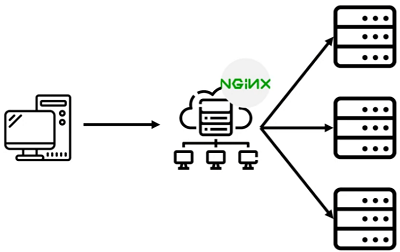

# Nginx搭建文件服务器



搭建流程：
1. [下载](http://nginx.org/en/download.html)并解压Nginx压缩包
2. 切换到`nginx-<version>`根目录下，查看Nginx版本：`nginx.exe -v`
3. 修改`/nginx-<version>/conf/nginx.conf`配置文件：
    ```javascript
    autoindex on;# 显示目录
    autoindex_exact_size on;# 显示文件大小
    autoindex_localtime on;# 显示文件时间

    server {
        charset      utf-8,gbk; # windows 服务器下设置后，依然乱码，暂时无解
        listen       9050 default_server;
        listen       [::]:9050 default_server;
        server_name  _;
        root         ../root/;
    }
    ```
4. 检查Nginx配置文件语法正确性：`nginx.exe -t -c conf/nginx.conf`
5. 启动Nginx：`nginx.exe -c conf/nginx.conf`
6. 通过[http://127.0.0.1:9050](http://127.0.0.1:9050)访问文件服务器
7. 关闭Nginx：`nginx.exe -s stop`

媒体资源获取：
- [音频获取](https://pixabay.com/music/search/short)
- [视频获取](https://ssyoutube.com/en307)

学习资料：
- [Nginx官网](http://nginx.org)
- [Nginx源码](https://github.com/nginx/nginx)
- [Nginx极简教程](https://dunwu.github.io/nginx-tutorial)
- [Nginx开发从入门到精通](http://tengine.taobao.org/book/index.html)
